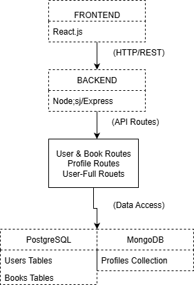

Comparatif SQL vs NoSQL et Modèle Hybride
Ce que j’ai capté (et galéré à comprendre au début)

### SQL (PostgreSQL dans ce projet)

C’est le bon élève : carré, structuré, tout doit être propre et bien rangé.
Tu veux ajouter une colonne ? Faut faire une migration, sinon il panique.
Mais une fois tout bien en place, c’est ultra fiable : transactions ACID, requêtes précises, relations propres entre les tables, et t’es sûr que tes données ne partent pas en freestyle.
Le souci ? Si tu veux scaler, t’as plutôt intérêt à acheter un serveur de compétition (bonjour la facture).

### NoSQL (MongoDB ici)

Alors lui, c’est l’artiste. Il s’en fout du schéma, tu peux lui balancer un objet avec trois champs ou quinze, il dit “ok frère”.
Il est parfait pour les trucs qui changent souvent, comme les préférences ou les historiques d’utilisateurs.
Il scale à l’horizontale (tu rajoutes des serveurs comme des Legos) et il est super rapide sur les gros volumes.
Mais il faut accepter un peu de chaos : pas de relations strictes, pas de contraintes fortes. Si tu veux être sûr de pas avoir des données bizarres, faut surveiller.

---

### Avantages et Inconvénients du modèle hybride

#### Les bons côtés :

- Flexibilité max : tu mets les trucs bien rangés dans PostgreSQL, et le bazar organisé (genre les historiques de lecture) dans MongoDB.
- Performance : chaque base fait ce qu’elle sait faire de mieux. SQL pour la cohérence, NoSQL pour la vitesse et la souplesse.
- Résilience : si Mongo tombe, SQL continue de vivre (et inversement, enfin en théorie).
- Scalabilité : t’as le meilleur des deux mondes, vertical et horizontal.

#### Les côtés relous :

- Complexité++ : t’as deux bases, donc deux connexions, deux syntaxes, deux cerveaux à utiliser.
- Cohérence à gérer : si un profil Mongo dépend d’un utilisateur SQL supprimé, tu dois nettoyer à la main (et t’oublies souvent).
- Coût : plus de serveurs = plus d’argent, c’est mathématique.
- Apprentissage : faut parler deux langages différents, genre être bilingue SQL/MongoDB. Le cerveau chauffe.

---

### La difficulté

Le vrai casse-tête, c’est la route mixte /api/user-full/:id.
Elle doit aller piocher les infos SQL et Mongo, les fusionner, et renvoyer le tout en un seul JSON bien propre.
Sauf que… quand t’as oublié d’attendre les promesses ou que Mongo met plus de temps que Postgres, ton JSON ressemble à une omelette mal cuite : des bouts de trucs manquent, ou l’appli freeze.
Bref, j’ai appris à aimer async/await (et à détester les erreurs de connexion “ECONNREFUSED”).

---

### En résumé

|                      | SQL                          | NoSQL                            | Hybride                            |
| -------------------- | ---------------------------- | -------------------------------- | ---------------------------------- |
| **Structure**        | Fixe, rigide                 | Libre, flexible                  | Mixte selon besoin                 |
| **Scalabilité**      | Verticale                    | Horizontale                      | Les deux                           |
| **Performances**     | Fort en requêtes complexes   | Rapide sur gros volumes          | Équilibré                          |
| **Maintenance**      | Simple mais rigide           | Flexible mais risqué             | Complexe mais puissant             |
| **Quand l’utiliser** | Données critiques, relations | Données dynamiques, volumineuses | Projet complet avec besoins variés |

---

### Conclusion :

Le modèle hybride, c’est un peu comme un couple SQL + NoSQL.
L’un est organisé, l’autre bordélique, mais ensemble ils font une super équipe (quand ils ne se disputent pas).
C’est plus galère à gérer, mais t’as le meilleur des deux mondes.

## Schéma simple de l'architecture

